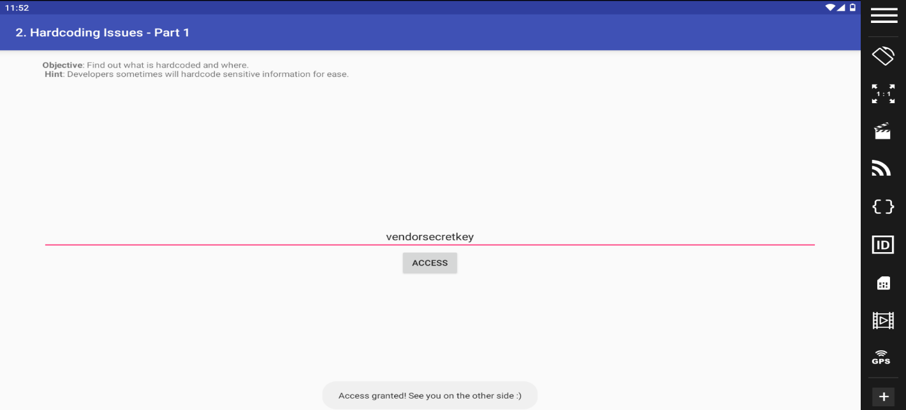
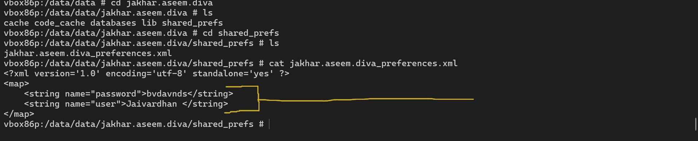
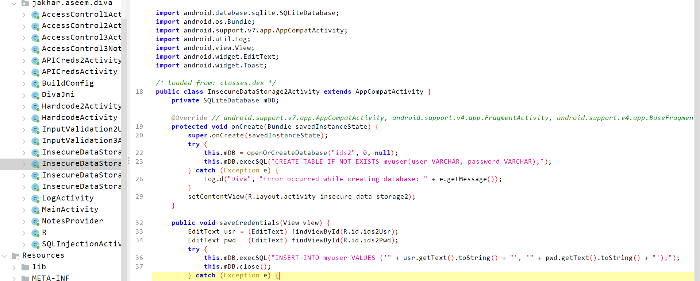
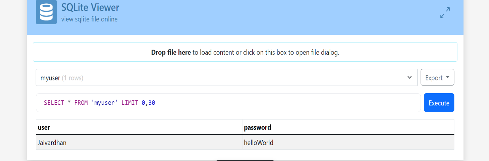
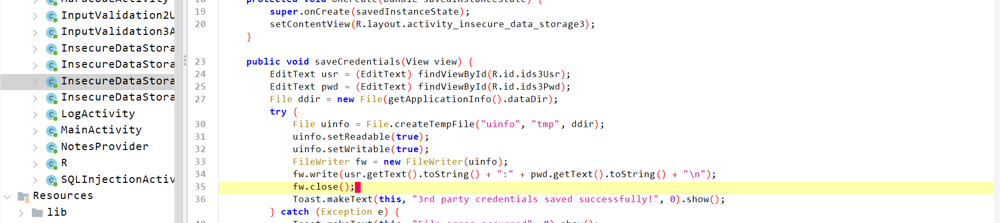
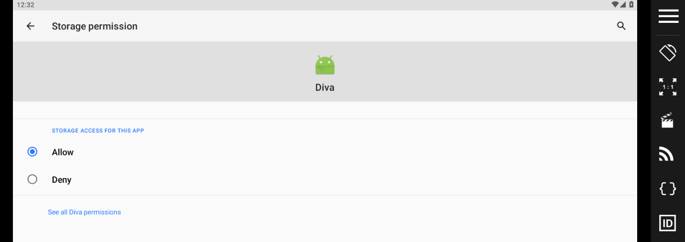
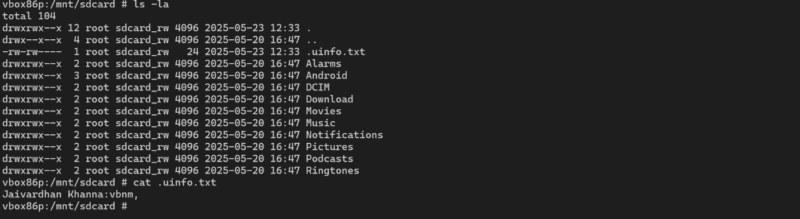
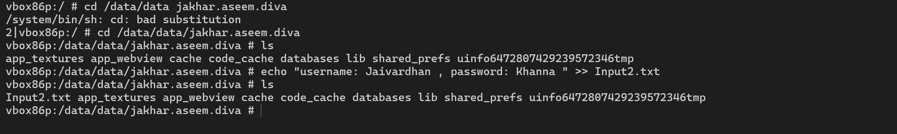

Dynamic Android Pentesting

(By: Jaivardhan Khanna)

This is a dynamic application analysis for ‘[DIVA](https://github.com/0xArab/diva-apk-file)’, which is a deliberately insecure Android application designed for educational and testing purposes.

Throughout this analysis, I went through a number of vulnerabilities, such as:

1.  Insecure Logging
2.  [Hardcoding Issues](https://www.bloomtech.com/article/what-is-hard-coding)
3.  Insecure Data Storage
4.  [Input Validation Issues](https://www.invicti.com/blog/web-security/input-validation-errors-root-of-all-evil/)
5.  [Access Control Issues](https://frontegg.com/guides/access-control-in-security)

Even though the application itself is pretty old and made deliberately vulnerable, it covers and showcases some of the most common made mistakes during app development and packaging. This allows developers, security professionals, and students to practice identifying and exploiting these issues to enhance their mobile application security skills.

Using a variety of tools for this case analysis, my toolkit included:

1.  [Genymotion](https://www.genymotion.com/)

    (an Android emulator for Windows, Mac and Linux).

2.  [Oracle Virtual Box](https://www.virtualbox.org/)

    (a tool for virtualizing x86 and AMD64/Intel64 computing architecture).

3.  [SDK Platform Tools](https://developer.android.com/tools/releases/platform-tools)

    (include tools that interface with the Android platform, primarily adb and fastboot).

4.  [Jadx-GUI](https://github.com/skylot/jadx/releases)

    (a GUI for decompiling a .apk file into its respective source code).

5.  [SQLite Viewer](https://inloop.github.io/sqlite-viewer/)

    (to view the embedded data in SQL queries that was being stored in the application).

**Initial Setup**

The steps for the setting up of Android machine, viewing the source code and connecting the android machine to windows terminal are as follow:

1.  Download all the required applications from the links provided.
2.  **Set-Up Genymotion:**
    You will need to Create and Account on [genymotion](https://www.genymotion.com/) in order to use the app.
    After logging in the app, while creating your ‘android device’, you will be given options to select the model of your Android Device, the Android Version you want to        use and the memory you want to assign to the device.
    Now, you just need to press the Button to start the device.
    Now, drag and drop the ‘DIVA’ apk file into your device and it will be installed as a app.
3.  **Using SDK tools:**
8.  Download the ‘platform-tools’ zip file and extract it.
9.  Right Click on the ‘platform-tools’ folder and open it in Terminal.
4. **Connecting Android Device to Terminal:**
11. Look at the top of the Genymotion box and you will find an IP address.
12. In the windows terminal, type the command

    *adb connect \<ip-address\>*

13. Now verify if you have connected to the device using

    *adb devices*

14. **Viewing the source code:**
15. Open the ‘jadx-gui’ folder and click on ‘ jadx-gui.exe ’.
16. After the application opens, click on Open File and select the ‘DIVA’ apk file and you will be able to see all of the components of the code of the apk file.

Now our environment is all set, so let’s explore all the vulnerabilities.

\*\*this specific windows terminal will be referred to as shell.*\*

*
I.  **Insecure Login**

    The goal is to find where the user data is being stored.

    On code inspection, we find that the data is being stored in the log files without any kind of encryption.
 

    So, to inspect it, we go to the terminal and type

    *adb shell logcat | grep diva*

*
II.  **Hardcoded Issue 1**

    The goal is to find the directly embedded value in the source code that allows authentication.

    Upon code inspection, we find that secret key is given in plain text format and written directly in the code.

    Therefore, when we enter “vendorsecretkey” as the input, we are granted access. 

*
III.  **Hardcoded Issue 2**

    The goal is to find the directly embedded value in the source code that allows authentication.

    Upon code inspection of this part, I noticed that there is a class being imported called “DivaJni”.

    Now, if we see the “DivaJni” class, we find that another class’s value is being called and used as the output of the “DivaJni” class.

    Since this is a library file, our first place to look for should be the “lib” folder of our apk file.

    In order to read these files, the steps are:

    Right click on “libdivajni.so” and select ‘Export’ to save the file on your desktop.
    Now open a new terminal on the desktop and use command.

    *strings libdivajni.so*

    This will give us a list of strings from the file.

    Upon testing each of them, I found the key to be: olsdfgad;lh

IV.  **Insecure data Storage 1**

    The goal is to find where/how the credentials are being stored.

    Upon code inspection of this part, I noticed that the ‘username’ and ‘password’ are being stored as in the “SharedPreferences” folder.

    So, I navigated to the ‘DIVA’ application folder in my android device :

    In the shell, I typed: cd /data/data
    I then type ‘ls’ to check what folders are there.
    Then, I moved to “jakhar.aseem.diva” directory and searched for folders using ‘ls’. I could see a folder named “shared_prefs” which had a file named 
    “jakhar.aseem.diva_preferences.xml”.

V.  **Insecure Data storage 2**

    The goal is to find where/how the credentials are being stored.

    Upon code inspection of this part, I noticed data being stored in the form of ‘SQL’.

    So, I navigated to the ‘DIVA’ application folder in my android device using the same steps as mentioned in ([**IV**](#IV)). I noticed a folder named “databases” which 
    had files with ‘.db’ extension. So, I downloaded the whole folder using the command:

    *adb pull /data/data/Jakhar.aseem.diva/databases*

    After this, I used the [SQLite Viewer](https://inloop.github.io/sqlite-viewer/) to view each file and I found:

VI.  **Insecure Data Storage 3**

    The goal is to find where/how the credentials are being stored.

    Upon code inspection of this part, I noticed that the credentials are being stored in the form of a temporary file with the initials “uinfo”.

    So, I navigated to the ‘DIVA’ application folder in my android device using the same steps as mentioned in ([**IV**](#IV)). I noticed a file with the initials “uinfo” 
    and upon looking at its contents:

VII.  **Insecure Data Storage 4**

    The goal is to find where/how the credentials are being stored.

    Upon code inspection of this part, I noticed that the data was being stored in an external SDCard.

    However, in my case, the application was not given permission to access external storage. So, in order to check out this vulnerability, I had to give permission to the 
    ‘DIVA’ app from settings.

    After giving the permission, the user credentials were being stored without error. So, from the shell, I opened the “mnt” directory inside of which was the “sdcard” 
    directory.

    What the catch here was, that a ‘ls’ command would only show visible directories, so, I ran the *ls -la* and found:

VIII.  **Input Data Validation Issue 1**

    The goal is to find all user data without knowing any usernames.

    Upon inspection of the source code, I found that this time, there wasn’t a section named as “InputValidation1” or something, so to identify my issue, I checked the log 
    of the app using logcat in the shell.

    *logcat | grep diva*

    This shows that when an input is being entered, the application calls for the file named “SQLInjectionActivity”, upon looking at the file, I found the required user 
    credentials.

IX.  **Input Data Validation Issue 2**

    The goal is to access any sensitive information apart from a web URL.

    Upon looking at the source code, I could tell that the input section will take a parameter without validating it or checking any system restrictions. 
![]  (media/2cbb6cc48ae0ae380607b6026506c532.png)

    So, that means that if I enter a file url into the input section, I can access that file. To test it, I made a dummy file.

    Now, If I enter the file path as the input parameter, I get:

X. **Input Data Validation Issue 3**

    This time the goal is to NOT to find the hidden code, but to crash the app.

    Upon code inspection of this part, I noticed that there is a class being imported called “DivaJni”, like it did in ([**III**](#III)).

    So, I inspected the library file “libdivajni.so”, I found in ([**III**](#III)):

    The possibility of a usage of ‘strcpy’ makes the app vulnerable to ‘[Buffer-Overflow] 
    (https://hackerone.com/reports/2871792#:~:text=The%20vulnerability%20is%20caused%20by,memory%2C%20including%20the%20return%20address.)’.

    To put this to test, I started spamming random characters until the string was long enough, which came to be:

    “*HelloFROM(JAIVARDHANKHANNA)3K\#9y&\#&41470744\#\$FJr3f;rGJgjt2t9gyy0y69uy9yu-6u-y86u9h689-h82gh5-8gh59g5989gh5-h94hg994hg84g9h95hg*”

    After entering this as input, I got the system error:

XI. **Access Control Issue 1**

    The goal is to access the API credentials outside from the app.

    Upon inspection of the code, I could see, that the button started an activity “jakhar.aseem.diva.action.VIEW_CREDS”. Therefore, upon using:

    *logcat | grep “jakhar.aseem.diva.action.VIEW_CREDS”*

    When I inspected the "APICredsActivity”, I could see the hardcoded credentials.

    Now that I knew which activity was used to store the credentials, I could bypass the button in the app from the shell, using:

    *am start -n jakhar.aseem.diva/.APICredsActivity*

    This causes the screen to show credentials without having to interact with the app.

XII. **Access Control Issue 2**

    The goal is to find access the api credentials for ’Tveeter’ without the pin and outside the app.

    Upon inspection of the code, I could see, that the button started an activity “jakhar.aseem.diva.action.VIEW_CREDS2”. Therefore, upon using:

    *logcat | grep “jakhar.aseem.diva.action.VIEW_CREDS2”*

    When I inspected the "APICredsActivity”, I could see the hardcoded credentials. However, in this case, I also noticed a ‘boolean-check’ was there to verify if the pin 
    was there or not.

    Now that I knew which activity was used to store the credentials, I could bypass the button in the app from the shell, using:

    *am start -n  jakhar.aseem.diva/.APICreds2Activity --ez check_pin false*

    This causes the screen to show credentials without having to interact with the app and entering the Pin.

XIII. **Access Control Issue 3**

    The goal is to access the notes of the app outside of the app.

    Upon inspection of the code, I noticed that registered pins are getting stored in “shared_prefs”:

    Therefore, when I entered the pin that was saved in “shared_prefs”, it launches the “AccessControl3NotesActivity” activity:

    Upon inspecting the “AccessControl3NotesActivity”, I noticed that after validating the pin, the notes are shown via a [content query](https://developer.android.com/guide/topics/providers/content-provider-basics) with the “NotesProvider” class:

    So, when I inspect the “NotesProvider” class, I find the URI:

    We can access the notes without the app using the command:

    **content query --uricontent://jakhar.aseem.diva.provider.notesprovider/notes**

**Conclusion**

This dynamic analysis of the ‘[DIVA](https://github.com/0xArab/diva-apk-file)’ Android application has provided valuable hands-on experience in identifying and exploiting common mobile security vulnerabilities, such as insecure logging, hardcoded secrets, and improper access controls. While ‘[DIVA](https://github.com/0xArab/diva-apk-file)’ is intentionally vulnerable for educational purposes, the issues uncovered closely mirror real-world threats faced by production Android apps.

After my analysis, I was also interested in how can one prevent such vulnerabilities. I can tell you briefly but here are the references if you want to read the full articles:

1.  [Insecure Logging](https://developer.android.com/privacy-and-security/risks/log-info-disclosure)

    *Never log sensitive information such as credentials or personal data. Use log levels appropriately and sanitize logs before release.*

2.  [Hardcoding Issues](https://blog.codacy.com/hard-coded-secrets#HowtoAvoidHardCodedSecrets)

    *Avoid embedding secrets, API keys, or credentials directly in the source code. Use secure storage solutions and environment variables.*

3.  [Insecure Data Storage](https://owasp.org/www-project-mobile-top-10/2023-risks/m9-insecure-data-storage)

    *Store sensitive data using encrypted storage mechanisms (e.g., Android Keystore, EncryptedSharedPreferences). Avoid storing sensitive data in plain text or external storage.*

4.  [Input Validation Issues](https://www.invicti.com/blog/web-security/input-validation-errors-root-of-all-evil/)

    *Always validate and sanitize user input on both client and server sides to prevent injection attacks and unintended behavior.*

5.  [Access Control Issues](https://cheatsheetseries.owasp.org/cheatsheets/Authorization_Cheat_Sheet.html)

    *Implement proper authentication and authorization checks for all sensitive actions and data. Avoid relying solely on client-side controls.*

**References**

-   <https://cheatsheetseries.owasp.org>

    [OWASP Cheat Sheets for secure coding practices]

-   <https://developer.android.com>
-   [official Android Developers portal for documentation]
-   <https://medium.com>

    [Medium hosts community-written articles]

-   <https://www.invicti.com/blog>

    [Invicti’s blog covers web and application security topics]

-   <https://www.perplexity.ai>

    [AI-powered search and research assistant useful for quickly gathering information]

-   <https://www.github.com>

    [reference code samples, tools, or community discussions ]

(Jaivardhan, 2025)
    `Kindly refer to the word file for better formatting.`
